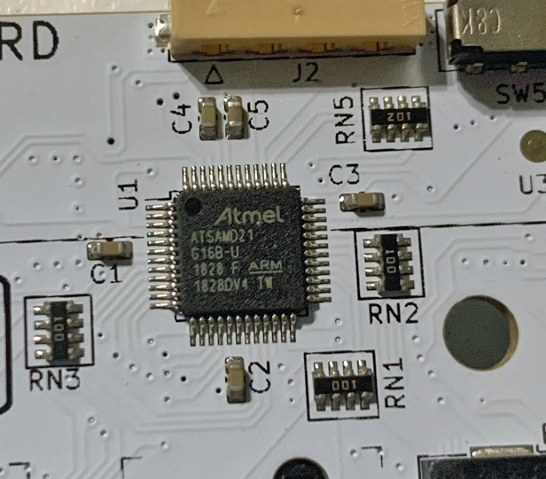
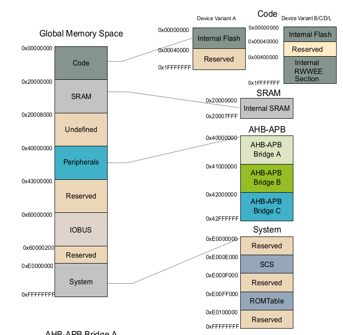
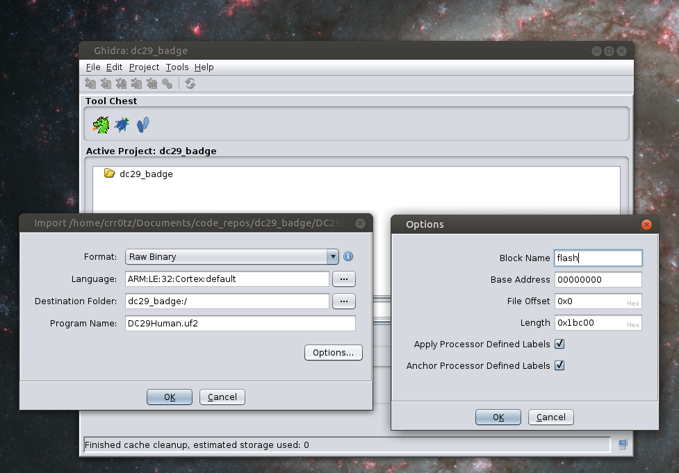
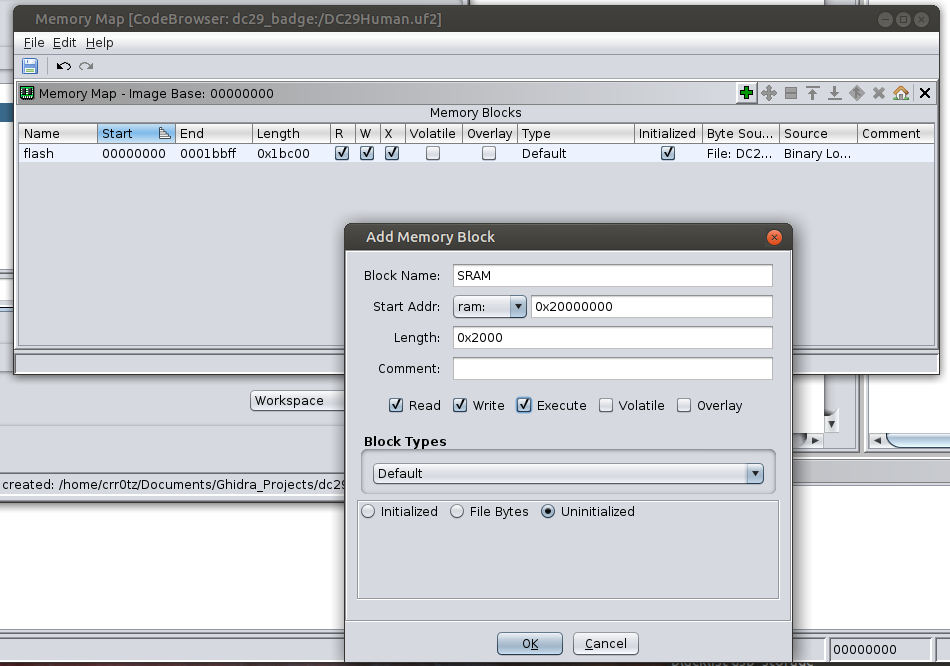

# DEFCON 29 Badge Adventures
Brain dump of trial and error for DC29 badge hacks.

## Badge Strings
From the serial console, noticed that the message contains, what for better explainiation, would be seven (7) blocks, some stay the same and some change. These were collected by issuing the '4' command to generate a request string.
```
43 AF 6ED9 B3 145231 6C4B12 DBFC794040
1C AF 8189 B3 A498C2 6C4B12 8F9A27440C
B5 AF 72BA B3 EF6C7C 6C4B12 29FBD0B372
37 AF 77B6 B3 1A8158 6C4B12 E43DE53FB4
F3 AF CBEE B3 34A32A 6C4B12 9BB70E9C3F
```
Using the request/response strings that people were posting on Discord, tried twiddling the bits of the changing blocks to see if I could generate a valid response. And it worked.
```
Req/Res
2D 8D 9DD1 22 D25425 EAD812 2C6144F8A1
BD 8D AFB3 22 6C874B EAD813 8D01583FF6

Req/Res
BA 8D AF17 22 680564 EAD812 DF7E9EE165
51 8D AFB3 22 6CA44B EAD813 1701353FE2
```

Used this to help generate the badgefuzz.py code. This script will level up the badge (phase0=get all badge types) and "share the signal" (pase1=share signal 20 times).

TODO - there is likely a pattern to generate the codes for the different badge types. I think somene already got that? Would be cool to do some experimenting to get that sus'd out.


## Firmware
Started looking into the firmware update that was on the site. Ghidra doesn't know the format, so need to set up the processor and memory types.

To start - the processor. There were some pictures of the chip on the Defcon Forums site [NEED SOURCE]. 


The text indicated that it is a ATSAMD21G16B. Pick up the data sheet from the Micochip site.
[SAM-D21DA1-Family-Data-Sheet-DS40001882G.pdf](SAM-D21DA1-Family-Data-Sheet-DS40001882G.pdf)

```
SAMD = General Purpose Microcontroller
21 =  32-bit Cortex-M0+ 
G = 48 pins
16 = 64 KB Program Memory
B = Added RWWEE support
8 KB Data Memory
```

Endianness could go either way, but my guess is it's little-endian. What about addresses. On page 39


So the Ghidra setup I'm trying is:


With that, load the code view - but do not analyze yet. Instead, add the SRAM memory map:


Save changes and now analyze. First is a call to reset at DAT_9e5d5157. This is outside of the memory range of the firmware sample. So what is it? Page 47, section 11.1.3 may have this info. It's somewhere between MTB and SCB.
```
0xE000ED00 System Control Block (SCB)
0x41006000 (see also Product Mapping) Micro Trace Buffer (MTB)
```

Page 49 talks about the MTB.
```
When enabled, the MTB records changes in program flow, reported by the Cortex-M0+ processor over the execution
trace interface shared between the Cortex-M0+ processor and the CoreSight MTB-M0+. This information is stored
as trace packets in the SRAM by the MTB. An off-chip debugger can extract the trace information using the Debug
Access Port to read the trace information from the SRAM. The debugger can then reconstruct the program flow from
this information
The base address of the MTB registers is 0x41006000; this address is also written in the CoreSight ROM Table. The
offset of each register from the base address is fixed and as defined by the CoreSight MTB-M0+ Technical Reference
Manual. The MTB has four programmable registers to control the behavior of the trace features:
POSITION: Contains the trace Write Pointer and the wrap bit,
MASTER: Contains the main trace enable bit and other trace control fields,
FLOW: Contains the WATERMARK address and the AUTOSTOP and AUTOHALT control bits,
BASE: Indicates where the SRAM is located in the processor memory map. This register is provided to enable
auto-discovery of the MTB SRAM location, by a debug agent.
See the CoreSight MTB-M0+ Technical Reference Manual for a detailed description of these registers.

```
